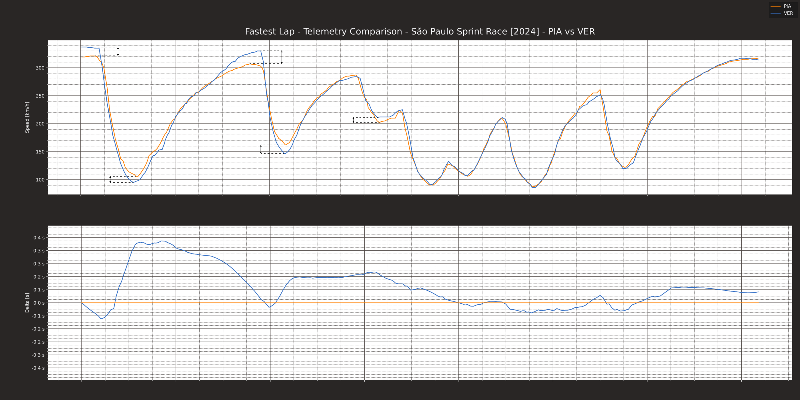
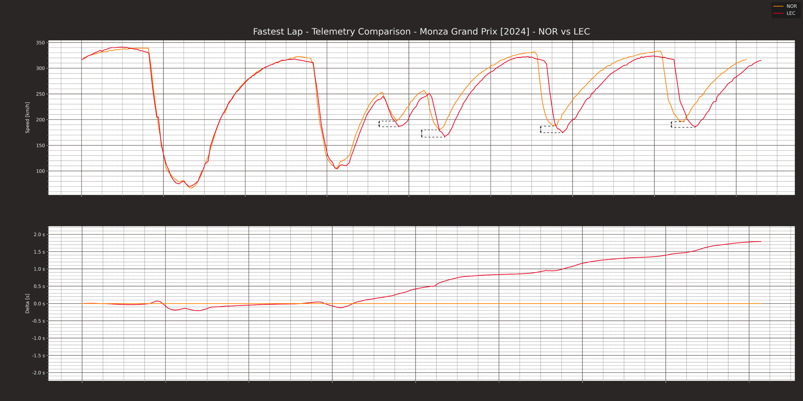
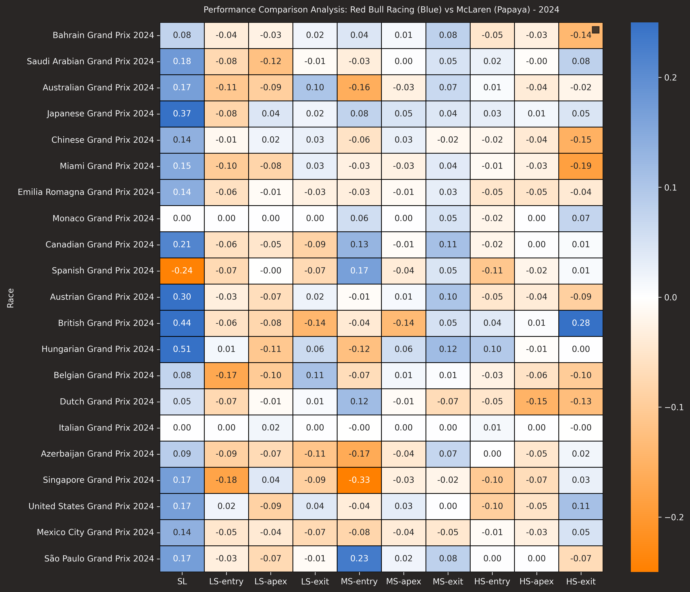
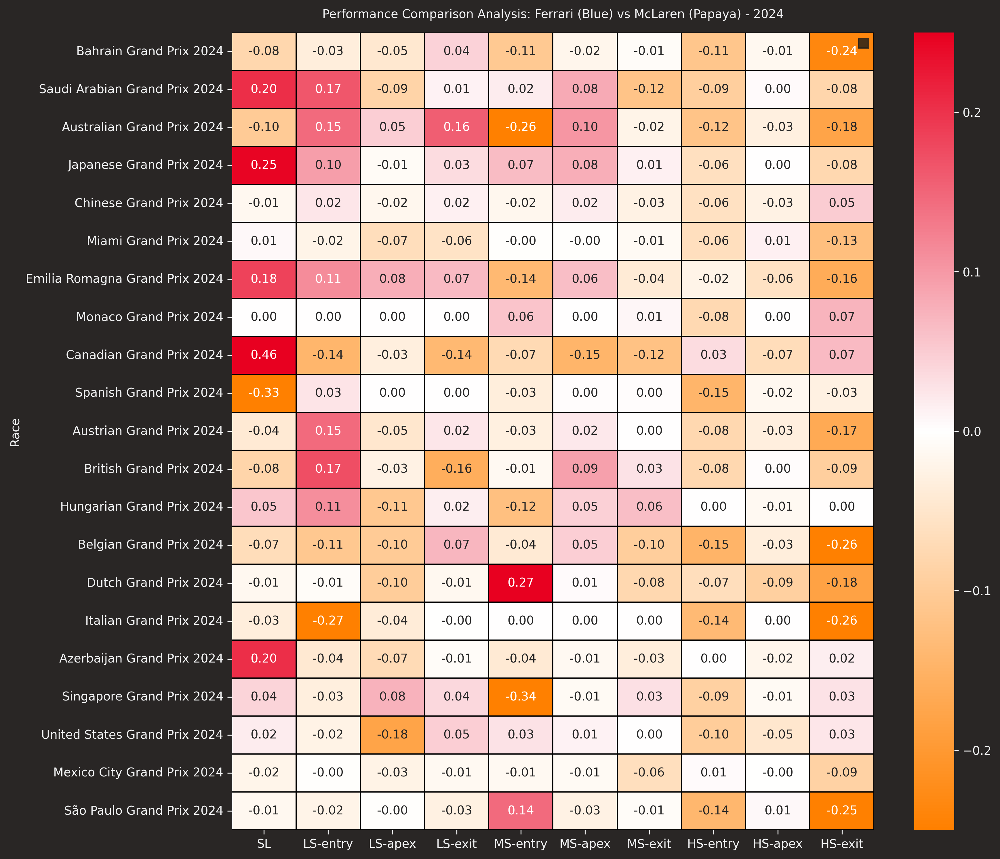
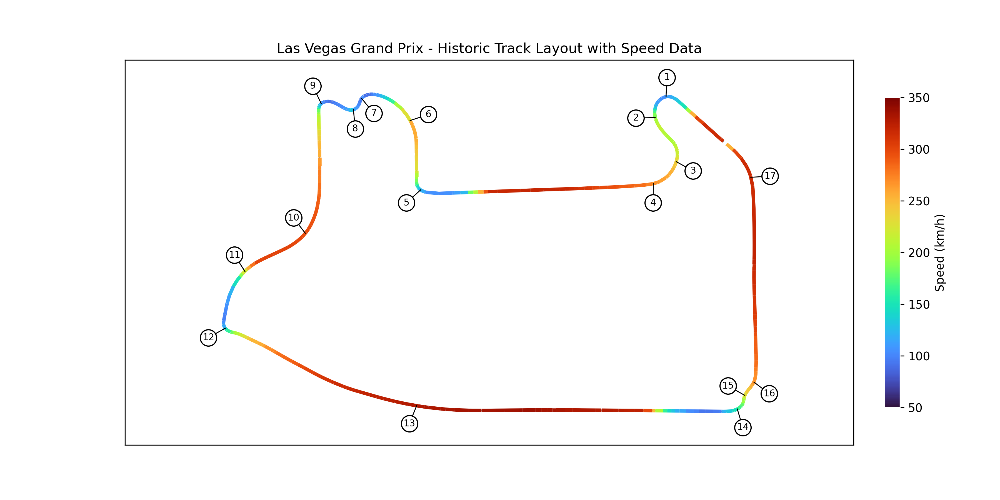
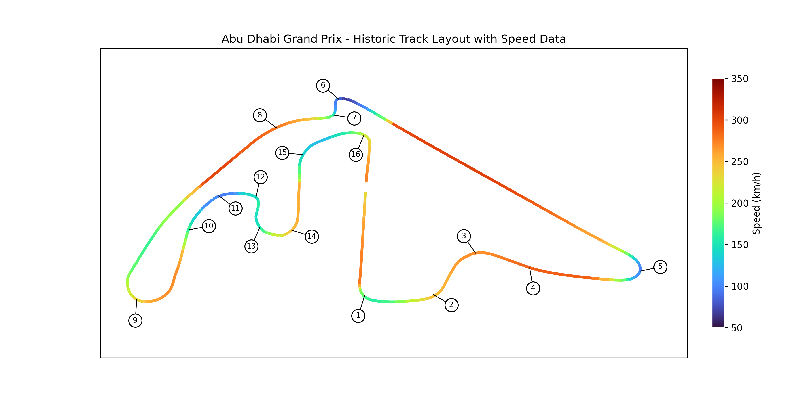
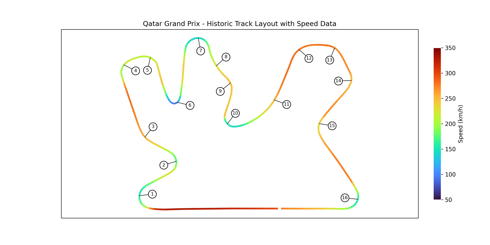

# Brief Analysis Report

## Introduction

Currently leading the constructors title fight, but in a tight championship battle, I believe McLaren’s success in the final triple header will rely on targeting track-specific developments, capitalising on the high-downforce setup when suitable, whilst balancing out straight-line performance with other title contenders in critical straight-line sections.

## 2024 Season Telemetry Analysis

Using the fastf1 python package, the comparison between Piastri and Verstappen’s Sao Paulo sprint race telemetry shows a dichotomy in the performance of the McLaren.

A higher downforce setup allowed the McLaren to move faster through the medium-speed corners, however, the reduced drag of the Red Bull resulted in a large delta between the maximum speeds of the cars. Clearly visible in the delta trace, time gained cornering allowed Piastri to maintain a lead over Verstappen in the sprint, with the cars performing fairly equally through lower speed sections.

Looking back to the Italian Grand Prix, a very similar story can be seen between Norris and Leclerc. Consistently faster through all sections of the higher speed corners, the aerodynamic benefits of the higher downforce setup at this circuit were clear, despite Ferrari’s one stop strategy clinching them the top spot.

## 2024 Season Profile Performance Heatmaps

    
    

This general trend of moving competitively through the medium to high speed corners and far slower in the low-speed and straight line segments is visible across the season. Plotting a heatmap to compare speed profile by circuit of the Ferrari and Red Bull cars to the McLarens, the strength of the McLaren, particularly against the Ferrari, can be seen across the year in sections requiring the most downforce (see columns HS-Entry, HS-Apex, HS-Exit). 

Conversely, both the Ferrari and Red Bull cars dominate over the McLaren in straight line speed and lower-speed cornering, where the higher drag setup leaves the McLaren lagging behind (see column SL).

## Development Focus: Las Vegas GP

As such, moving into the triple header the focus must be on optimising the aerodynamic setup to match the characteristics of each track. 

Specifically, the long high-speed straights and twisting low-speed corners of the Las Vegas circuit pose a large threat to the title fight. Focusing on developing a lower drag setup going into the race weekend would allow the McLaren to hold its own against overtake attempts in straight line sections whilst maintaining fairly equal performance through the lower-speed corners.

The potential Las Vegas points swing, particularly in Ferrari’s favour, could be significant in the championship battle. Therefore, developments such as adjusting the angle of the louvres and cutouts on the endplates to reduce turbulent flow over the rear wing or simulating various diffusor setups to stop the ground effect unduly lowering the rake and causing excess drag on the car in the straights could help balance out the McLaren’s performance.

## Development Focus: Rest of the Season

    
    

For Qatar and Abu Dhabi, where medium-speed cornering is critical, retaining a higher-downforce aerodynamic setup should allow McLaren to remain competitive. As the smooth nature of both tracks may help to reduce some of the more unpredictable behaviours of competitor cars, maximising the current setup advantage on these higher downforce tracks will be essential in maintaining the points gap to the chasing teams and the lead in the constructors title fight.